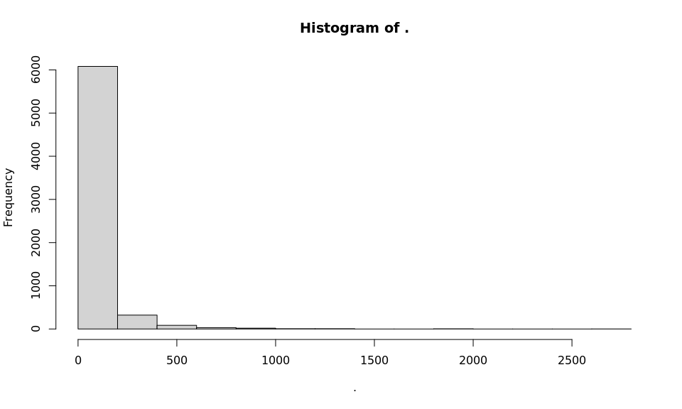
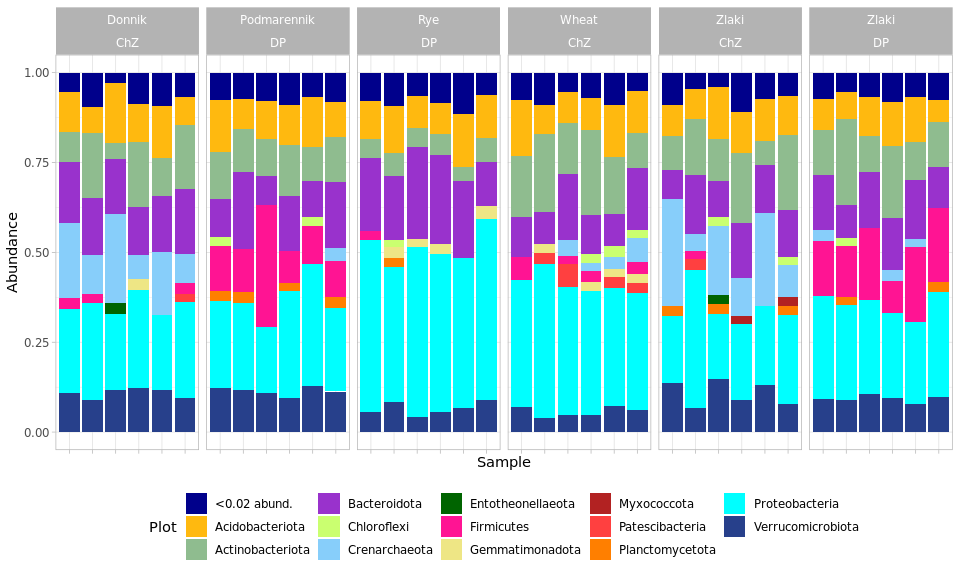
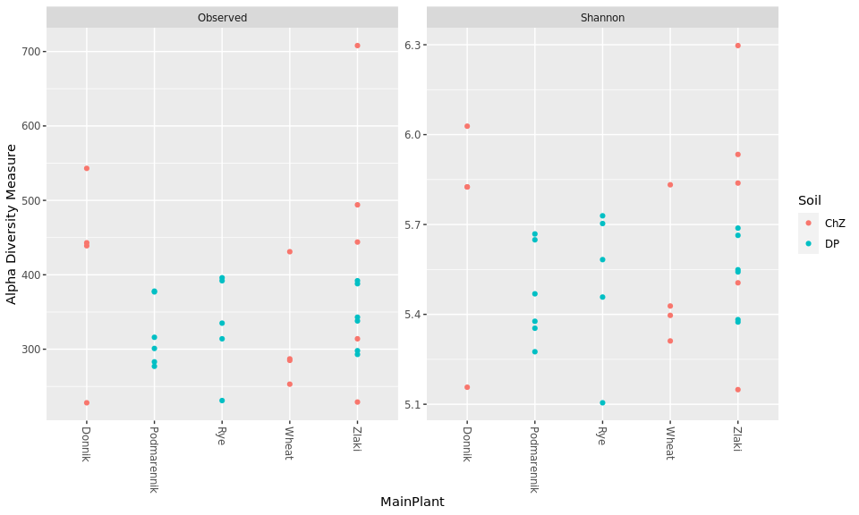
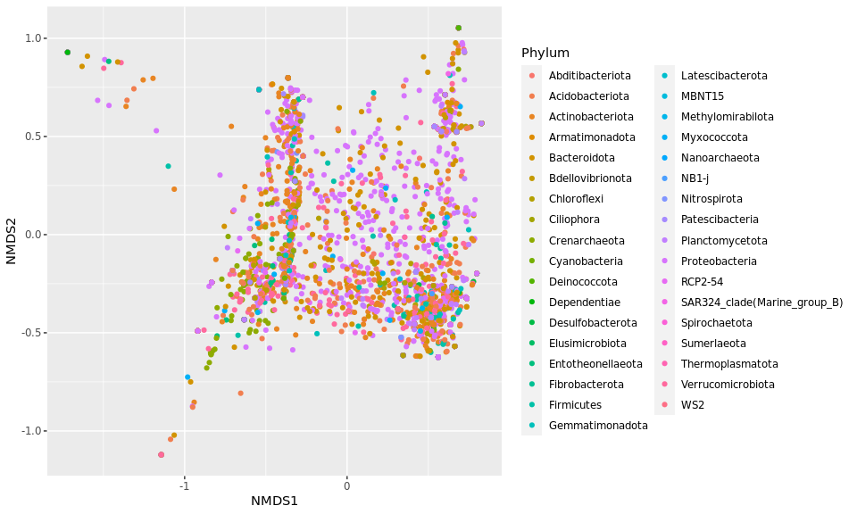
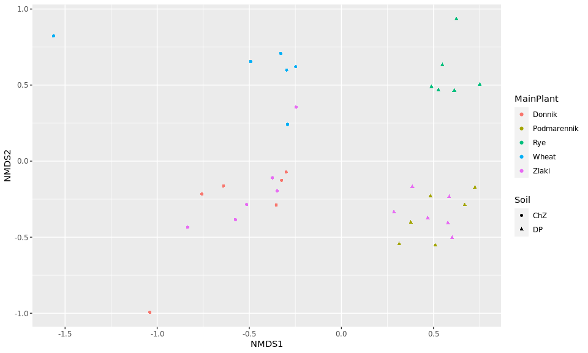

```r
knitr::opts_chunk$set(fig.width = 10, fig.height = 6)
 

library('phyloseq')
library('tidyverse')


set.seed(5678)
setwd('~/Praktikum/TyumGU_2023/')
ps <- readRDS("ps.RData")
ps
```

```
## phyloseq-class experiment-level object
## otu_table()   OTU Table:         [ 6551 taxa and 36 samples ]
## sample_data() Sample Data:       [ 36 samples by 7 sample variables ]
## tax_table()   Taxonomy Table:    [ 6551 taxa by 6 taxonomic ranks ]
## refseq()      DNAStringSet:      [ 6551 reference sequences ]
```

## Brief view on samples


```r
sample_sums(ps) %>% sort()
```

```
##      ChZ.Wheat.1.run_3     ChZ.Donnik.2.run_3         DP.Rye.2.run_4 
##                   1041                   1454                   5163 
##      ChZ.Zlaki.3.run_3     ChZ.Donnik.1.run_3      ChZ.Wheat.3.run_3 
##                   5895                   6208                   7856 
##      ChZ.Wheat.2.run_4      ChZ.Wheat.1.run_4      ChZ.Wheat.2.run_3 
##                   8105                   8269                   9374 
##     ChZ.Donnik.3.run_3      ChZ.Zlaki.1.run_3         DP.Rye.3.run_4 
##                   9426                   9795                   9937 
## DP.Podmarennik.1.run_3 DP.Podmarennik.2.run_4 DP.Podmarennik.3.run_3 
##                  10391                  10432                  10476 
##       DP.Zlaki.2.run_4         DP.Rye.1.run_4      ChZ.Zlaki.2.run_3 
##                  10950                  12507                  12595 
##       DP.Zlaki.3.run_3       DP.Zlaki.3.run_4         DP.Rye.2.run_3 
##                  12626                  12683                  12755 
##       DP.Zlaki.2.run_3 DP.Podmarennik.3.run_4       DP.Zlaki.1.run_4 
##                  12996                  13523                  13637 
##         DP.Rye.1.run_3 DP.Podmarennik.1.run_4 DP.Podmarennik.2.run_3 
##                  13674                  13733                  14161 
##      ChZ.Wheat.3.run_4     ChZ.Donnik.3.run_4         DP.Rye.3.run_3 
##                  15309                  15444                  15771 
##      ChZ.Zlaki.1.run_4       DP.Zlaki.1.run_3      ChZ.Zlaki.3.run_4 
##                  16076                  16431                  17419 
##     ChZ.Donnik.2.run_4     ChZ.Donnik.1.run_4      ChZ.Zlaki.2.run_4 
##                  17619                  19577                  25619
```

```r
taxa_sums(ps) %>%  hist()
```

<!-- -->


## Remove chloroplast and mitochondria


```r
# ps@tax_table %>% View()

ps.filtered <- subset_taxa(ps, Phylum != "NA")

asvs.keep <-ps@tax_table %>% 
      data.frame() %>%  
      filter((Family != "Mitochondria" & Order != "Chloroplast") %>%
              replace_na(TRUE)) %>% 
      rownames()
ps.notrash <- prune_taxa(asvs.keep, ps.filtered)

# ps.notrash@tax_table %>% View()
```


## Plot barplots


```r
bargraph <- function(ps, rank, threshold=0.05, percents=FALSE){
  require(dplyr)
  require(ggplot2)
  require(phyloseq)
  
  ps <- prune_taxa(taxa_sums(ps) > 0, ps)
  ps2 <- tax_glom(ps, taxrank = rank)
  ps3 = transform_sample_counts(ps2, function(x) x / sum(x) )
  data <- psmelt(ps3) # create dataframe from phyloseq object
  data$Plot <- as.character(data[,rank]) # convert to character
  data$Plot[data$Abundance < threshold] <- paste0("<", threshold, " abund.")
  medians <- data %>% group_by(Plot) %>% mutate(median=median(data$Abundance))
  remainder <- medians[medians$median <= threshold,]$Plot
  data$Percentage = ifelse(data$Plot != paste0("<", threshold, " abund."),
                           round(data$Abundance, 3)*100, NA)
  
  # create palette long enough for our data
  base.palette <- c("darkblue", "darkgoldenrod1", "darkseagreen", "darkorchid", "darkolivegreen1", "lightskyblue", 
                    "darkgreen", "deeppink", "khaki2", "firebrick", "brown1", "darkorange1", "cyan1", "royalblue4", 
                    "darksalmon", "dodgerblue3", "steelblue1", "darkgoldenrod1", "brown1", "cyan1", "darkgrey")
  required.colors <- nlevels(factor(data$Plot))
  repeats = required.colors %/% length(base.palette) + 1
  palette <- rep(base.palette, length.out = repeats * length(base.palette))
  
  p <- ggplot(data=data, aes(x=Sample, y=Abundance, fill=Plot))
  p + geom_bar(aes(), stat="identity", position="stack") + theme_light() +
    scale_fill_manual(values = palette) +
    theme(legend.position="bottom") + guides() +
    theme(axis.text.x = element_text(angle = 90)) +
    if (percents) {
      geom_text(aes(label = Percentage),
                position = position_stack(vjust = 0.5), size = 1.5)
    }
  
}

bargraph(ps.notrash, "Phylum", 0.02) +
  facet_grid(~MainPlant + Soil ,scales = 'free_x') +
  theme(axis.text.x = element_blank())
```

<!-- -->

## Plot alpha-diversity


```r
sample_sums(ps.notrash) %>% sort()
```

```
##      ChZ.Wheat.1.run_3     ChZ.Donnik.2.run_3         DP.Rye.2.run_4 
##                   1039                   1422                   4952 
##      ChZ.Zlaki.3.run_3     ChZ.Donnik.1.run_3      ChZ.Wheat.3.run_3 
##                   5788                   6018                   7780 
##      ChZ.Wheat.2.run_4      ChZ.Wheat.1.run_4     ChZ.Donnik.3.run_3 
##                   8005                   8224                   9119 
##      ChZ.Wheat.2.run_3      ChZ.Zlaki.1.run_3         DP.Rye.3.run_4 
##                   9332                   9703                   9814 
## DP.Podmarennik.2.run_4 DP.Podmarennik.1.run_3 DP.Podmarennik.3.run_3 
##                  10335                  10365                  10421 
##       DP.Zlaki.2.run_4         DP.Rye.1.run_4      ChZ.Zlaki.2.run_3 
##                  10888                  12314                  12432 
##       DP.Zlaki.3.run_3         DP.Rye.2.run_3       DP.Zlaki.3.run_4 
##                  12465                  12487                  12595 
##       DP.Zlaki.2.run_3 DP.Podmarennik.3.run_4         DP.Rye.1.run_3 
##                  12905                  13430                  13431 
##       DP.Zlaki.1.run_4 DP.Podmarennik.1.run_4 DP.Podmarennik.2.run_3 
##                  13439                  13614                  14140 
##     ChZ.Donnik.3.run_4      ChZ.Wheat.3.run_4         DP.Rye.3.run_3 
##                  14895                  15103                  15508 
##      ChZ.Zlaki.1.run_4       DP.Zlaki.1.run_3      ChZ.Zlaki.3.run_4 
##                  15868                  16268                  17213 
##     ChZ.Donnik.2.run_4     ChZ.Donnik.1.run_4      ChZ.Zlaki.2.run_4 
##                  17390                  19129                  25169
```

```r
ps.raref <- rarefy_even_depth(ps.notrash, sample.size = 8000)
```

```
## You set `rngseed` to FALSE. Make sure you've set & recorded
##  the random seed of your session for reproducibility.
## See `?set.seed`
```

```
## ...
```

```
## 6 samples removedbecause they contained fewer reads than `sample.size`.
```

```
## Up to first five removed samples are:
```

```
## DP.Rye.2.run_4ChZ.Zlaki.3.run_3ChZ.Donnik.1.run_3ChZ.Donnik.2.run_3ChZ.Wheat.1.run_3
```

```
## ...
```

```
## 468OTUs were removed because they are no longer 
## present in any sample after random subsampling
```

```
## ...
```

```r
plot_richness(ps.raref, x = "MainPlant", measures=c("Observed", "Shannon"), color = "Soil")
```

<!-- -->

## Beta-diversity


```r
ordinations <- ordinate(ps.notrash, "NMDS", "bray")
```

```
## Square root transformation
## Wisconsin double standardization
## Run 0 stress 0.1394515 
## Run 1 stress 0.2012947 
## Run 2 stress 0.1905232 
## Run 3 stress 0.1394793 
## ... Procrustes: rmse 0.002592267  max resid 0.01163541 
## Run 4 stress 0.2111221 
## Run 5 stress 0.1394514 
## ... New best solution
## ... Procrustes: rmse 7.739017e-05  max resid 0.000394324 
## ... Similar to previous best
## Run 6 stress 0.1394793 
## ... Procrustes: rmse 0.002584922  max resid 0.01167269 
## Run 7 stress 0.1394793 
## ... Procrustes: rmse 0.002583798  max resid 0.01168393 
## Run 8 stress 0.1908147 
## Run 9 stress 0.1394793 
## ... Procrustes: rmse 0.002584176  max resid 0.01167981 
## Run 10 stress 0.1394514 
## ... New best solution
## ... Procrustes: rmse 2.392203e-05  max resid 0.0001214684 
## ... Similar to previous best
## Run 11 stress 0.1394514 
## ... Procrustes: rmse 1.343337e-05  max resid 6.72255e-05 
## ... Similar to previous best
## Run 12 stress 0.1394793 
## ... Procrustes: rmse 0.002587853  max resid 0.01165474 
## Run 13 stress 0.1862989 
## Run 14 stress 0.1572451 
## Run 15 stress 0.190523 
## Run 16 stress 0.1394514 
## ... New best solution
## ... Procrustes: rmse 5.843194e-06  max resid 2.860155e-05 
## ... Similar to previous best
## Run 17 stress 0.1394514 
## ... New best solution
## ... Procrustes: rmse 6.295532e-07  max resid 2.298212e-06 
## ... Similar to previous best
## Run 18 stress 0.1394793 
## ... Procrustes: rmse 0.002587265  max resid 0.01165896 
## Run 19 stress 0.1908147 
## Run 20 stress 0.1394514 
## ... Procrustes: rmse 4.933735e-05  max resid 0.0002505857 
## ... Similar to previous best
## *** Best solution repeated 2 times
```

```r
plot_ordination(ps.notrash, ordinations, type="taxa", color="Phylum")
```

<!-- -->

```r
plot_ordination(ps.notrash, ordinations, type="samples", color="MainPlant", shape = "Soil")
```

<!-- -->

## Ideas to check

1.
2.
3.
