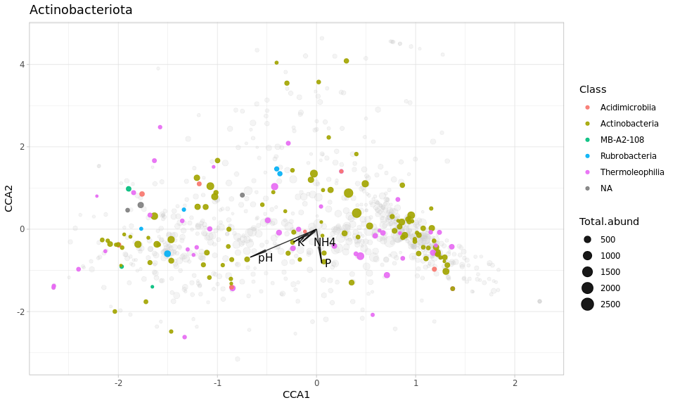

```r
knitr::opts_chunk$set(fig.width = 10, fig.height = 6)
 
library('phyloseq')
library('tidyverse')
library('vegan')


set.seed(5678)
setwd('~/Praktikum/TyumGU_2023/')
ps <- readRDS("ps.no.organells.RData")

# Select only samples with more than 8k reads per sample
ps <- prune_samples(sample_sums(ps) > 8000, ps)
ps
```

```
## phyloseq-class experiment-level object
## otu_table()   OTU Table:         [ 6104 taxa and 30 samples ]
## sample_data() Sample Data:       [ 30 samples by 7 sample variables ]
## tax_table()   Taxonomy Table:    [ 6104 taxa by 6 taxonomic ranks ]
## refseq()      DNAStringSet:      [ 6104 reference sequences ]
```

## Alpha-diversity


```r
# rarefy to minimal depth
ps.raref <- rarefy_even_depth(ps)
```

```
## You set `rngseed` to FALSE. Make sure you've set & recorded
##  the random seed of your session for reproducibility.
## See `?set.seed`
```

```
## ...
```

```
## 469OTUs were removed because they are no longer 
## present in any sample after random subsampling
```

```
## ...
```

```r
plot_richness(ps.raref, x = "MainPlant", measures=c("Observed", "Simpson"), color = "Soil")
```

<!-- -->

Our suggestion: Observed ASV in the DP soil is lower, than in the BS soil. Lets test it.

Make a table with desirable diversity index


```r
alpha_div <- function(ps, measures){
  ps <- prune_taxa(taxa_sums(ps) > 0, ps)
  obs_sim <- estimate_richness(ps, measures = measures)
  Soil <- ps@sam_data$Soil
  MainPlant <- ps@sam_data$MainPlant
  alpha <- cbind(obs_sim, Soil, MainPlant)
  return(alpha)
}

alpha <- alpha_div(ps.raref, c("Observed", "Simpson"))
alpha
```

```
##                        Observed   Simpson Soil   MainPlant
## ChZ.Zlaki.1.run_4           444 0.9965123  ChZ       Zlaki
## ChZ.Zlaki.2.run_4           708 0.9977781  ChZ       Zlaki
## ChZ.Zlaki.3.run_4           494 0.9967657  ChZ       Zlaki
## ChZ.Donnik.1.run_4          543 0.9971181  ChZ      Donnik
## ChZ.Donnik.2.run_4          443 0.9964381  ChZ      Donnik
## ChZ.Donnik.3.run_4          439 0.9964732  ChZ      Donnik
## ChZ.Wheat.1.run_4           287 0.9948299  ChZ       Wheat
## ChZ.Wheat.2.run_4           286 0.9946276  ChZ       Wheat
## ChZ.Wheat.3.run_4           431 0.9965468  ChZ       Wheat
## DP.Zlaki.1.run_4            392 0.9956515   DP       Zlaki
## DP.Zlaki.2.run_4            338 0.9952939   DP       Zlaki
## DP.Zlaki.3.run_4            342 0.9950876   DP       Zlaki
## DP.Podmarennik.1.run_4      377 0.9956821   DP Podmarennik
## DP.Podmarennik.2.run_4      283 0.9945628   DP Podmarennik
## DP.Podmarennik.3.run_4      379 0.9958516   DP Podmarennik
## DP.Rye.1.run_4              396 0.9960759   DP         Rye
## DP.Rye.3.run_4              231 0.9926705   DP         Rye
## ChZ.Zlaki.1.run_3           229 0.9930215  ChZ       Zlaki
## ChZ.Zlaki.2.run_3           314 0.9952658  ChZ       Zlaki
## ChZ.Donnik.3.run_3          228 0.9932511  ChZ      Donnik
## ChZ.Wheat.2.run_3           252 0.9943465  ChZ       Wheat
## DP.Zlaki.1.run_3            388 0.9958062   DP       Zlaki
## DP.Zlaki.2.run_3            298 0.9941486   DP       Zlaki
## DP.Zlaki.3.run_3            293 0.9942790   DP       Zlaki
## DP.Podmarennik.1.run_3      277 0.9942817   DP Podmarennik
## DP.Podmarennik.2.run_3      301 0.9919805   DP Podmarennik
## DP.Podmarennik.3.run_3      316 0.9949097   DP Podmarennik
## DP.Rye.1.run_3              335 0.9955783   DP         Rye
## DP.Rye.2.run_3              314 0.9948707   DP         Rye
## DP.Rye.3.run_3              392 0.9962135   DP         Rye
```


```r
wilcox.test(Observed ~ Soil, data = alpha)
```

```
## Warning in wilcox.test.default(x = DATA[[1L]], y = DATA[[2L]], ...): cannot
## compute exact p-value with ties
```

```
## 
## 	Wilcoxon rank sum test with continuity correction
## 
## data:  Observed by Soil
## W = 132.5, p-value = 0.3681
## alternative hypothesis: true location shift is not equal to 0
```
We are not really able to use two-way ANOVA (unweighted groups), but we'll try


```r
aov <- aov(Observed ~ Soil + MainPlant, data = alpha)
summary(aov)
```

```
##             Df Sum Sq Mean Sq F value Pr(>F)
## Soil         1  26241   26241   2.577  0.121
## MainPlant    4  37800    9450   0.928  0.464
## Residuals   24 244358   10182
```

```r
# TukeyHSD(aov, conf.level=0.95)
```

No, there is no significant difference


## Beta-diversity


```r
ps.prop <- transform_sample_counts(ps, function(x) x/sum(x))
ord.pcoa.bray <- ordinate(ps.prop, method='PCoA', distance='bray')
plot_ordination(ps.prop, ord.pcoa.bray, color = 'MainPlant', shape = "Soil") +
    geom_point(size=3, alpha=0.7) + 
    theme_light()
```

<!-- -->

Our suggestion: DP and ChZ forms separate clusters (Rye is in even more separate)


```r
dist <- phyloseq::distance(ps, method = "bray")
sample_df <- data.frame(sample_data(ps))
 
permanova <- adonis2(dist ~ Soil + MainPlant, data = sample_df)
permanova
```

```
## Permutation test for adonis under reduced model
## Terms added sequentially (first to last)
## Permutation: free
## Number of permutations: 999
## 
## adonis2(formula = dist ~ Soil + MainPlant, data = sample_df)
##           Df SumOfSqs      R2      F Pr(>F)    
## Soil       1   1.4665 0.12489 4.4983  0.001 ***
## MainPlant  4   2.4517 0.20879 1.8801  0.001 ***
## Residual  24   7.8241 0.66632                  
## Total     29  11.7423 1.00000                  
## ---
## Signif. codes:  0 '***' 0.001 '**' 0.01 '*' 0.05 '.' 0.1 ' ' 1
```

```r
# Use pairwise adonis as a post-hoc test
dp.only.ps <- subset_samples(ps, Soil == "DP")
dp.only.dist <- phyloseq::distance(dp.only.ps, method = "bray")
pairwiseAdonis::pairwise.adonis(dp.only.dist, dp.only.ps@sam_data$MainPlant)
```

```
##                  pairs Df SumsOfSqs   F.Model         R2 p.value p.adjusted sig
## 1 Zlaki vs Podmarennik  1 0.3193128 0.9731644 0.08868585   0.518      1.000    
## 2         Zlaki vs Rye  1 0.9284577 2.9451921 0.24655879   0.001      0.003   *
## 3   Podmarennik vs Rye  1 0.8524772 2.5218213 0.21887350   0.003      0.009   *
```

```r
chz.only.ps <- subset_samples(ps, Soil == "ChZ")
chz.only.dist <- phyloseq::distance(chz.only.ps, method = "bray")
pairwiseAdonis::pairwise.adonis(chz.only.dist, chz.only.ps@sam_data$MainPlant)
```

```
##             pairs Df SumsOfSqs   F.Model        R2 p.value p.adjusted sig
## 1 Zlaki vs Donnik  1 0.2929485 0.9017254 0.1141175   0.735      1.000    
## 2  Zlaki vs Wheat  1 0.6633231 2.0054460 0.2226926   0.023      0.069    
## 3 Donnik vs Wheat  1 0.6692979 2.1156954 0.2606918   0.035      0.105
```

Yep, our suggestion has been proved!

## CCA

How about the connection between nutritional factors and microbial populations?


```r
# Collapse samples according to nutrition data. Add nutrition data to metadata section
ps@sam_data
```

```
##                                   Filename   MainPlant Soil Spot Region
## ChZ.Zlaki.1.run_4        zverev-ks-16s-106       Zlaki  ChZ    1   Soil
## ChZ.Zlaki.2.run_4        zverev-ks-16s-107       Zlaki  ChZ    2    ChZ
## ChZ.Zlaki.3.run_4        zverev-ks-16s-108       Zlaki  ChZ    3    ChZ
## ChZ.Donnik.1.run_4       zverev-ks-16s-112      Donnik  ChZ    1    ChZ
## ChZ.Donnik.2.run_4       zverev-ks-16s-113      Donnik  ChZ    2    ChZ
## ChZ.Donnik.3.run_4       zverev-ks-16s-114      Donnik  ChZ    3    ChZ
## ChZ.Wheat.1.run_4        zverev-ks-16s-118       Wheat  ChZ    1    ChZ
## ChZ.Wheat.2.run_4        zverev-ks-16s-119       Wheat  ChZ    2    ChZ
## ChZ.Wheat.3.run_4        zverev-ks-16s-120       Wheat  ChZ    3    ChZ
## DP.Zlaki.1.run_4         zverev-ks-16s-124       Zlaki   DP    1    ChZ
## DP.Zlaki.2.run_4         zverev-ks-16s-125       Zlaki   DP    2     DP
## DP.Zlaki.3.run_4         zverev-ks-16s-126       Zlaki   DP    3     DP
## DP.Podmarennik.1.run_4   zverev-ks-16s-130 Podmarennik   DP    1     DP
## DP.Podmarennik.2.run_4   zverev-ks-16s-131 Podmarennik   DP    2     DP
## DP.Podmarennik.3.run_4   zverev-ks-16s-132 Podmarennik   DP    3     DP
## DP.Rye.1.run_4           zverev-ks-16s-136         Rye   DP    1     DP
## DP.Rye.3.run_4           zverev-ks-16s-138         Rye   DP    3     DP
## ChZ.Zlaki.1.run_3      zverev-rhiz-103-16s       Zlaki  ChZ    1    16s
## ChZ.Zlaki.2.run_3      zverev-rhiz-104-16s       Zlaki  ChZ    2    16s
## ChZ.Donnik.3.run_3     zverev-rhiz-111-16s      Donnik  ChZ    3    16s
## ChZ.Wheat.2.run_3      zverev-rhiz-116-16s       Wheat  ChZ    2    16s
## DP.Zlaki.1.run_3       zverev-rhiz-121-16s       Zlaki   DP    1    16s
## DP.Zlaki.2.run_3       zverev-rhiz-122-16s       Zlaki   DP    2    16s
## DP.Zlaki.3.run_3       zverev-rhiz-123-16s       Zlaki   DP    3    16s
## DP.Podmarennik.1.run_3 zverev-rhiz-127-16s Podmarennik   DP    1    16s
## DP.Podmarennik.2.run_3 zverev-rhiz-128-16s Podmarennik   DP    2    16s
## DP.Podmarennik.3.run_3 zverev-rhiz-129-16s Podmarennik   DP    3    16s
## DP.Rye.1.run_3         zverev-rhiz-133-16s         Rye   DP    1    16s
## DP.Rye.2.run_3         zverev-rhiz-134-16s         Rye   DP    2    16s
## DP.Rye.3.run_3         zverev-rhiz-135-16s         Rye   DP    3    16s
##                        Illumina_run               SampleID
## ChZ.Zlaki.1.run_4             run_4      ChZ.Zlaki.1.run_4
## ChZ.Zlaki.2.run_4             run_4      ChZ.Zlaki.2.run_4
## ChZ.Zlaki.3.run_4             run_4      ChZ.Zlaki.3.run_4
## ChZ.Donnik.1.run_4            run_4     ChZ.Donnik.1.run_4
## ChZ.Donnik.2.run_4            run_4     ChZ.Donnik.2.run_4
## ChZ.Donnik.3.run_4            run_4     ChZ.Donnik.3.run_4
## ChZ.Wheat.1.run_4             run_4      ChZ.Wheat.1.run_4
## ChZ.Wheat.2.run_4             run_4      ChZ.Wheat.2.run_4
## ChZ.Wheat.3.run_4             run_4      ChZ.Wheat.3.run_4
## DP.Zlaki.1.run_4              run_4       DP.Zlaki.1.run_4
## DP.Zlaki.2.run_4              run_4       DP.Zlaki.2.run_4
## DP.Zlaki.3.run_4              run_4       DP.Zlaki.3.run_4
## DP.Podmarennik.1.run_4        run_4 DP.Podmarennik.1.run_4
## DP.Podmarennik.2.run_4        run_4 DP.Podmarennik.2.run_4
## DP.Podmarennik.3.run_4        run_4 DP.Podmarennik.3.run_4
## DP.Rye.1.run_4                run_4         DP.Rye.1.run_4
## DP.Rye.3.run_4                run_4         DP.Rye.3.run_4
## ChZ.Zlaki.1.run_3             run_3      ChZ.Zlaki.1.run_3
## ChZ.Zlaki.2.run_3             run_3      ChZ.Zlaki.2.run_3
## ChZ.Donnik.3.run_3            run_3     ChZ.Donnik.3.run_3
## ChZ.Wheat.2.run_3             run_3      ChZ.Wheat.2.run_3
## DP.Zlaki.1.run_3              run_3       DP.Zlaki.1.run_3
## DP.Zlaki.2.run_3              run_3       DP.Zlaki.2.run_3
## DP.Zlaki.3.run_3              run_3       DP.Zlaki.3.run_3
## DP.Podmarennik.1.run_3        run_3 DP.Podmarennik.1.run_3
## DP.Podmarennik.2.run_3        run_3 DP.Podmarennik.2.run_3
## DP.Podmarennik.3.run_3        run_3 DP.Podmarennik.3.run_3
## DP.Rye.1.run_3                run_3         DP.Rye.1.run_3
## DP.Rye.2.run_3                run_3         DP.Rye.2.run_3
## DP.Rye.3.run_3                run_3         DP.Rye.3.run_3
```

```r
ps@sam_data$Samples <- paste(ps@sam_data$Soil, ps@sam_data$MainPlant, ps@sam_data$Spot, sep=".")
ps.merged <- ps %>% merge_samples(group = "Samples")
```

```
## Warning in asMethod(object): NAs introduced by coercion

## Warning in asMethod(object): NAs introduced by coercion

## Warning in asMethod(object): NAs introduced by coercion

## Warning in asMethod(object): NAs introduced by coercion

## Warning in asMethod(object): NAs introduced by coercion

## Warning in asMethod(object): NAs introduced by coercion

## Warning in asMethod(object): NAs introduced by coercion
```

```r
ps.merged@sam_data
```

```
##                  Filename MainPlant Soil Spot Region Illumina_run SampleID
## ChZ.Donnik.1           NA        NA   NA    1     NA           NA       NA
## ChZ.Donnik.2           NA        NA   NA    2     NA           NA       NA
## ChZ.Donnik.3           NA        NA   NA    3     NA           NA       NA
## ChZ.Wheat.1            NA        NA   NA    1     NA           NA       NA
## ChZ.Wheat.2            NA        NA   NA    2     NA           NA       NA
## ChZ.Wheat.3            NA        NA   NA    3     NA           NA       NA
## ChZ.Zlaki.1            NA        NA   NA    1     NA           NA       NA
## ChZ.Zlaki.2            NA        NA   NA    2     NA           NA       NA
## ChZ.Zlaki.3            NA        NA   NA    3     NA           NA       NA
## DP.Podmarennik.1       NA        NA   NA    1     NA           NA       NA
## DP.Podmarennik.2       NA        NA   NA    2     NA           NA       NA
## DP.Podmarennik.3       NA        NA   NA    3     NA           NA       NA
## DP.Rye.1               NA        NA   NA    1     NA           NA       NA
## DP.Rye.2               NA        NA   NA    2     NA           NA       NA
## DP.Rye.3               NA        NA   NA    3     NA           NA       NA
## DP.Zlaki.1             NA        NA   NA    1     NA           NA       NA
## DP.Zlaki.2             NA        NA   NA    2     NA           NA       NA
## DP.Zlaki.3             NA        NA   NA    3     NA           NA       NA
##                  Samples
## ChZ.Donnik.1          NA
## ChZ.Donnik.2          NA
## ChZ.Donnik.3          NA
## ChZ.Wheat.1           NA
## ChZ.Wheat.2           NA
## ChZ.Wheat.3           NA
## ChZ.Zlaki.1           NA
## ChZ.Zlaki.2           NA
## ChZ.Zlaki.3           NA
## DP.Podmarennik.1      NA
## DP.Podmarennik.2      NA
## DP.Podmarennik.3      NA
## DP.Rye.1              NA
## DP.Rye.2              NA
## DP.Rye.3              NA
## DP.Zlaki.1            NA
## DP.Zlaki.2            NA
## DP.Zlaki.3            NA
```

```r
agro <- read.csv("agro.csv")
rownames(agro) <- agro$SampleID
agro
```

```
##                          SampleID  pH   P   K   NH4
## ChZ.Donnik.1         ChZ.Donnik.1 7.4 178 265 26.99
## ChZ.Donnik.2         ChZ.Donnik.2 7.5 185 252 28.33
## ChZ.Donnik.3         ChZ.Donnik.3 7.4 258 219 19.92
## ChZ.Wheat.1           ChZ.Wheat.1 4.3  16 223  3.23
## ChZ.Wheat.2           ChZ.Wheat.2 2.6  18 134  5.42
## ChZ.Wheat.3           ChZ.Wheat.3 3.0  12  92  8.29
## ChZ.Zlaki.1           ChZ.Zlaki.1 5.2  80 370 46.54
## ChZ.Zlaki.2           ChZ.Zlaki.2 5.5  80 349 36.98
## ChZ.Zlaki.3           ChZ.Zlaki.3 5.4  52 332 27.29
## DP.Podmarennik.1 DP.Podmarennik.1 5.2 170 126 16.14
## DP.Podmarennik.2 DP.Podmarennik.2 4.8 166 122  0.18
## DP.Podmarennik.3 DP.Podmarennik.3 5.1 229 126 13.16
## DP.Rye.1                 DP.Rye.1 4.3 104 303 57.87
## DP.Rye.2                 DP.Rye.2 4.4 120 429 24.31
## DP.Rye.3                 DP.Rye.3 4.3  83 235 19.74
## DP.Zlaki.1             DP.Zlaki.1 4.4 120 429 24.31
## DP.Zlaki.2             DP.Zlaki.2 4.3  83 235 19.74
## DP.Zlaki.3             DP.Zlaki.3 4.3 104 303 57.87
```

```r
if (all(rownames(agro) == rownames(ps.merged@sam_data))) {
  ps.merged@sam_data <- sample_data(agro)
  print("Replaced")
}
```

```
## [1] "Replaced"
```

```r
ps.merged@sam_data
```

```
##                          SampleID  pH   P   K   NH4
## ChZ.Donnik.1         ChZ.Donnik.1 7.4 178 265 26.99
## ChZ.Donnik.2         ChZ.Donnik.2 7.5 185 252 28.33
## ChZ.Donnik.3         ChZ.Donnik.3 7.4 258 219 19.92
## ChZ.Wheat.1           ChZ.Wheat.1 4.3  16 223  3.23
## ChZ.Wheat.2           ChZ.Wheat.2 2.6  18 134  5.42
## ChZ.Wheat.3           ChZ.Wheat.3 3.0  12  92  8.29
## ChZ.Zlaki.1           ChZ.Zlaki.1 5.2  80 370 46.54
## ChZ.Zlaki.2           ChZ.Zlaki.2 5.5  80 349 36.98
## ChZ.Zlaki.3           ChZ.Zlaki.3 5.4  52 332 27.29
## DP.Podmarennik.1 DP.Podmarennik.1 5.2 170 126 16.14
## DP.Podmarennik.2 DP.Podmarennik.2 4.8 166 122  0.18
## DP.Podmarennik.3 DP.Podmarennik.3 5.1 229 126 13.16
## DP.Rye.1                 DP.Rye.1 4.3 104 303 57.87
## DP.Rye.2                 DP.Rye.2 4.4 120 429 24.31
## DP.Rye.3                 DP.Rye.3 4.3  83 235 19.74
## DP.Zlaki.1             DP.Zlaki.1 4.4 120 429 24.31
## DP.Zlaki.2             DP.Zlaki.2 4.3  83 235 19.74
## DP.Zlaki.3             DP.Zlaki.3 4.3 104 303 57.87
```

Make CCA for the top 1000 most abundant ASVs


```r
veganifyOTU <- function(physeq){
  require(phyloseq)
  if(taxa_are_rows(physeq)){physeq <- t(physeq)}
  return(as(otu_table(physeq), "matrix"))
}

ps.top1k <- names(sort(taxa_sums(ps.merged), decreasing = TRUE)[1:1000]) %>% 
  prune_taxa(ps.merged)

otus.ps.vegan <- veganifyOTU(ps.top1k)
metadata <- as(sample_data(ps.top1k), "data.frame")


vare.cca <- vegan::cca(otus.ps.vegan ~  pH + P + K + NH4, data=metadata)
vare.cca
```

```
## Call: cca(formula = otus.ps.vegan ~ pH + P + K + NH4, data = metadata)
## 
##               Inertia Proportion Rank
## Total          3.9986     1.0000     
## Constrained    1.1380     0.2846    4
## Unconstrained  2.8606     0.7154   13
## Inertia is scaled Chi-square 
## 
## Eigenvalues for constrained axes:
##   CCA1   CCA2   CCA3   CCA4 
## 0.4724 0.2878 0.2042 0.1736 
## 
## Eigenvalues for unconstrained axes:
##    CA1    CA2    CA3    CA4    CA5    CA6    CA7    CA8    CA9   CA10   CA11 
## 0.5037 0.3801 0.2366 0.2154 0.2033 0.1892 0.1826 0.1788 0.1698 0.1600 0.1569 
##   CA12   CA13 
## 0.1544 0.1299
```

Check the CCA model


```r
anova(vare.cca)
```

```
## Permutation test for cca under reduced model
## Permutation: free
## Number of permutations: 999
## 
## Model: cca(formula = otus.ps.vegan ~ pH + P + K + NH4, data = metadata)
##          Df ChiSquare      F Pr(>F)  
## Model     4    1.1380 1.2929  0.013 *
## Residual 13    2.8606                
## ---
## Signif. codes:  0 '***' 0.001 '**' 0.01 '*' 0.05 '.' 0.1 ' ' 1
```

```r
anova(vare.cca, by="terms")
```

```
## Permutation test for cca under reduced model
## Terms added sequentially (first to last)
## Permutation: free
## Number of permutations: 999
## 
## Model: cca(formula = otus.ps.vegan ~ pH + P + K + NH4, data = metadata)
##          Df ChiSquare      F Pr(>F)   
## pH        1   0.36197 1.6450  0.007 **
## P         1   0.36393 1.6539  0.008 **
## K         1   0.23278 1.0579  0.327   
## NH4       1   0.17931 0.8149  0.844   
## Residual 13   2.86064                 
## ---
## Signif. codes:  0 '***' 0.001 '**' 0.01 '*' 0.05 '.' 0.1 ' ' 1
```

```r
vif.cca(vare.cca)
```

```
##       pH        P        K      NH4 
## 2.295310 2.435376 1.887855 1.699309
```
Our model is valid with four predictors: two significant and two unsignificant. I want to keep both.


```r
# uncomment this, if you want to see inside the model for the ...

# vare.cca$CCA$biplot # vectors
# vare.cca$CCA$u # samples
# vare.cca$CCA$v #ASVs
```
Ok, let's plot the data in two plots - for ASVs and for samples.

First, we have to fortify the model by taxonomic and sample information


```r
species.data <- vare.cca$CCA$v %>% 
               data.frame() %>% 
               mutate(ASV = rownames(.)) %>% 
               inner_join(data.frame(ASV = names(taxa_sums(ps.top1k)),
                                     Total.abund = taxa_sums(ps.top1k),
                                     ps.top1k@tax_table[,2], # Phylum
                                     ps.top1k@tax_table[,3]), # Class
                          by = "ASV")
species.data %>% head(10)
```

```
##           CCA1         CCA2        CCA3        CCA4   ASV Total.abund
## 1   0.81648675 -0.159409316  0.26873645 -0.28137056  ASV1        2670
## 2   0.82387770 -0.186943279  0.42366449 -0.05555805  ASV2        1891
## 3   0.96499977  0.002374073  0.53418232 -0.38087281  ASV3        1934
## 4   1.09724452 -0.230278062  0.30663289 -0.15402168  ASV4        1871
## 5   0.73831105 -0.302058785  0.23486025  0.12446156  ASV5        1913
## 6   0.01689017  0.126991932  0.40712954 -0.33728371  ASV6        1289
## 7   0.22070283 -0.463337613 -0.01248228 -0.47841764  ASV7        1193
## 8  -0.65016495 -0.063425842 -0.55062635 -0.17520393  ASV8        1152
## 9   0.52498216 -0.044276925 -0.34185534  0.16624243  ASV9        1218
## 10  0.40594811  0.391370344  0.39999238 -0.30417659 ASV10        1099
##              Phylum               Class
## 1        Firmicutes             Bacilli
## 2        Firmicutes             Bacilli
## 3        Firmicutes             Bacilli
## 4        Firmicutes             Bacilli
## 5        Firmicutes             Bacilli
## 6    Proteobacteria Alphaproteobacteria
## 7    Proteobacteria Gammaproteobacteria
## 8     Crenarchaeota     Nitrososphaeria
## 9    Proteobacteria Gammaproteobacteria
## 10 Actinobacteriota      Actinobacteria
```

```r
samples.data <- vare.cca$CCA$u %>% 
  data.frame() %>% 
  mutate(Names = rownames(.)) %>% 
  inner_join(ps@sam_data, by = c("Names" = "Samples"))

samples.data
```

```
##          CCA1        CCA2        CCA3        CCA4            Names
## 1  -1.8178459 -0.70200273  0.64384701  0.04257148     ChZ.Donnik.1
## 2  -1.8237766 -0.76247181  0.75909222  0.27088630     ChZ.Donnik.2
## 3  -0.5475189 -1.69207639  1.21492246 -0.20365822     ChZ.Donnik.3
## 4  -0.5475189 -1.69207639  1.21492246 -0.20365822     ChZ.Donnik.3
## 5  -1.0975863  2.09463672  0.22057926 -1.22218226      ChZ.Wheat.1
## 6   0.8758261  2.27541570  0.41594457 -0.25402598      ChZ.Wheat.2
## 7   0.8758261  2.27541570  0.41594457 -0.25402598      ChZ.Wheat.2
## 8   0.2650542  2.56676262  0.78152151  0.43593131      ChZ.Wheat.3
## 9  -0.6195575 -0.06211594 -1.13626208  0.55074521      ChZ.Zlaki.1
## 10 -0.6195575 -0.06211594 -1.13626208  0.55074521      ChZ.Zlaki.1
## 11 -1.0648580  0.18277060 -0.76997753  0.04401241      ChZ.Zlaki.2
## 12 -1.0648580  0.18277060 -0.76997753  0.04401241      ChZ.Zlaki.2
## 13 -1.5085414  0.82304769 -0.58071167 -0.47984939      ChZ.Zlaki.3
## 14  0.4370888 -0.01729442  1.24646802  0.50154801 DP.Podmarennik.1
## 15  0.4370888 -0.01729442  1.24646802  0.50154801 DP.Podmarennik.1
## 16  0.7369092  0.22640311  1.38816239 -0.71071540 DP.Podmarennik.2
## 17  0.7369092  0.22640311  1.38816239 -0.71071540 DP.Podmarennik.2
## 18  1.5477516 -0.94004195  1.35872851  0.13965759 DP.Podmarennik.3
## 19  1.5477516 -0.94004195  1.35872851  0.13965759 DP.Podmarennik.3
## 20  0.8614376 -0.37265432 -0.98884344  2.00602503         DP.Rye.1
## 21  0.8614376 -0.37265432 -0.98884344  2.00602503         DP.Rye.1
## 22  0.9444504 -0.77507975 -1.40667188 -1.90998875         DP.Rye.2
## 23  0.1723742  0.75376924  0.01178746 -0.20765288         DP.Rye.3
## 24  0.1723742  0.75376924  0.01178746 -0.20765288         DP.Rye.3
## 25  0.9444504 -0.77507975 -1.40667188 -1.90998875       DP.Zlaki.1
## 26  0.9444504 -0.77507975 -1.40667188 -1.90998875       DP.Zlaki.1
## 27  0.1723742  0.75376924  0.01178746 -0.20765288       DP.Zlaki.2
## 28  0.1723742  0.75376924  0.01178746 -0.20765288       DP.Zlaki.2
## 29  0.8614376 -0.37265432 -0.98884344  2.00602503       DP.Zlaki.3
## 30  0.8614376 -0.37265432 -0.98884344  2.00602503       DP.Zlaki.3
##               Filename   MainPlant Soil Spot Region Illumina_run
## 1    zverev-ks-16s-112      Donnik  ChZ    1    ChZ        run_4
## 2    zverev-ks-16s-113      Donnik  ChZ    2    ChZ        run_4
## 3    zverev-ks-16s-114      Donnik  ChZ    3    ChZ        run_4
## 4  zverev-rhiz-111-16s      Donnik  ChZ    3    16s        run_3
## 5    zverev-ks-16s-118       Wheat  ChZ    1    ChZ        run_4
## 6    zverev-ks-16s-119       Wheat  ChZ    2    ChZ        run_4
## 7  zverev-rhiz-116-16s       Wheat  ChZ    2    16s        run_3
## 8    zverev-ks-16s-120       Wheat  ChZ    3    ChZ        run_4
## 9    zverev-ks-16s-106       Zlaki  ChZ    1   Soil        run_4
## 10 zverev-rhiz-103-16s       Zlaki  ChZ    1    16s        run_3
## 11   zverev-ks-16s-107       Zlaki  ChZ    2    ChZ        run_4
## 12 zverev-rhiz-104-16s       Zlaki  ChZ    2    16s        run_3
## 13   zverev-ks-16s-108       Zlaki  ChZ    3    ChZ        run_4
## 14   zverev-ks-16s-130 Podmarennik   DP    1     DP        run_4
## 15 zverev-rhiz-127-16s Podmarennik   DP    1    16s        run_3
## 16   zverev-ks-16s-131 Podmarennik   DP    2     DP        run_4
## 17 zverev-rhiz-128-16s Podmarennik   DP    2    16s        run_3
## 18   zverev-ks-16s-132 Podmarennik   DP    3     DP        run_4
## 19 zverev-rhiz-129-16s Podmarennik   DP    3    16s        run_3
## 20   zverev-ks-16s-136         Rye   DP    1     DP        run_4
## 21 zverev-rhiz-133-16s         Rye   DP    1    16s        run_3
## 22 zverev-rhiz-134-16s         Rye   DP    2    16s        run_3
## 23   zverev-ks-16s-138         Rye   DP    3     DP        run_4
## 24 zverev-rhiz-135-16s         Rye   DP    3    16s        run_3
## 25   zverev-ks-16s-124       Zlaki   DP    1    ChZ        run_4
## 26 zverev-rhiz-121-16s       Zlaki   DP    1    16s        run_3
## 27   zverev-ks-16s-125       Zlaki   DP    2     DP        run_4
## 28 zverev-rhiz-122-16s       Zlaki   DP    2    16s        run_3
## 29   zverev-ks-16s-126       Zlaki   DP    3     DP        run_4
## 30 zverev-rhiz-123-16s       Zlaki   DP    3    16s        run_3
##                  SampleID
## 1      ChZ.Donnik.1.run_4
## 2      ChZ.Donnik.2.run_4
## 3      ChZ.Donnik.3.run_4
## 4      ChZ.Donnik.3.run_3
## 5       ChZ.Wheat.1.run_4
## 6       ChZ.Wheat.2.run_4
## 7       ChZ.Wheat.2.run_3
## 8       ChZ.Wheat.3.run_4
## 9       ChZ.Zlaki.1.run_4
## 10      ChZ.Zlaki.1.run_3
## 11      ChZ.Zlaki.2.run_4
## 12      ChZ.Zlaki.2.run_3
## 13      ChZ.Zlaki.3.run_4
## 14 DP.Podmarennik.1.run_4
## 15 DP.Podmarennik.1.run_3
## 16 DP.Podmarennik.2.run_4
## 17 DP.Podmarennik.2.run_3
## 18 DP.Podmarennik.3.run_4
## 19 DP.Podmarennik.3.run_3
## 20         DP.Rye.1.run_4
## 21         DP.Rye.1.run_3
## 22         DP.Rye.2.run_3
## 23         DP.Rye.3.run_4
## 24         DP.Rye.3.run_3
## 25       DP.Zlaki.1.run_4
## 26       DP.Zlaki.1.run_3
## 27       DP.Zlaki.2.run_4
## 28       DP.Zlaki.2.run_3
## 29       DP.Zlaki.3.run_4
## 30       DP.Zlaki.3.run_3
```


```r
# plot species
ggplot() +
  geom_point(data=species.data,
             aes(x=CCA1, y=CCA2, color=Phylum, size=Total.abund), alpha=0.9) +
  geom_segment(data = vare.cca$CCA$biplot %>% data.frame(), 
               aes(x = 0, xend = CCA1, y = 0, yend = CCA2), 
               alpha=0.8, color = "black",arrow = arrow(angle = 3)) +
  geom_text(data = vare.cca$CCA$biplot %>% 
                    data.frame() %>% 
                    mutate(Label = rownames(.)), 
            aes(x=CCA1, y=CCA2, label= Label,
                hjust = -0.5), size=4) +
  theme_light() +
  ggtitle("A: Species")
```

<!-- -->

Plot the same picture for different major (10 the most abundant) phyla


```r
major.phyla <- species.data %>% 
  group_by(Phylum) %>% 
  summarize(sum = sum(Total.abund)) %>% 
  arrange(desc(sum)) %>% 
  select(Phylum) %>% 
  head(10) %>% 
  as.vector()


for (i in major.phyla$Phylum) {
  p <- ggplot() +
    geom_point(data=species.data,
               aes(x=CCA1, y=CCA2, size=Total.abund), alpha=0.2, color="grey80") +
    geom_point(data=species.data %>% filter(Phylum == i),
               aes(x=CCA1, y=CCA2, color=Class, size=Total.abund), alpha=0.9) +
    geom_segment(data = vare.cca$CCA$biplot %>% data.frame(), 
                 aes(x = 0, xend = CCA1, y = 0, yend = CCA2), 
                 alpha=0.8, color = "black",arrow = arrow(angle = 3)) +
    geom_text(data = vare.cca$CCA$biplot %>% 
                      data.frame() %>% 
                      mutate(Label = rownames(.)), 
              aes(x=CCA1, y=CCA2, label= Label,
                  hjust = -0.5), size=4) +
    theme_light() +
    ggtitle(i)
  print(p)
}
```

<!-- --><!-- --><!-- --><!-- --><!-- --><!-- --><!-- --><!-- --><!-- --><!-- -->


```r
# plot samples
ggplot() +
  geom_point(data=samples.data,
             aes(x=CCA1, y=CCA2, color=MainPlant, shape = Soil), size=3, alpha=0.7) +
  geom_segment(data = vare.cca$CCA$biplot %>% data.frame(), 
               aes(x = 0, xend = CCA1, y = 0, yend = CCA2), 
               alpha=0.8, color = "black",arrow = arrow(angle = 3)) +
  geom_text(data = vare.cca$CCA$biplot %>% 
                    data.frame() %>% 
                    mutate(Label = rownames(.)), 
            aes(x=CCA1, y=CCA2, label= Label,
                hjust = -0.5), size=4) +
  theme_light() +
  ggtitle("B. Samples")
```

<!-- -->

