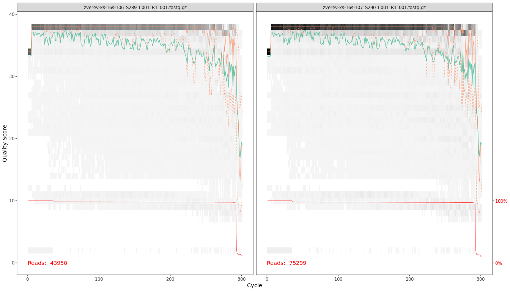
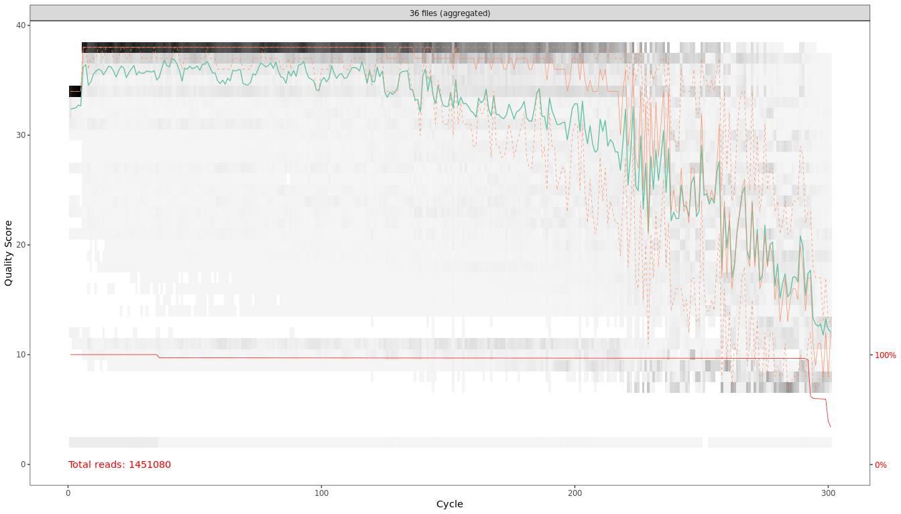
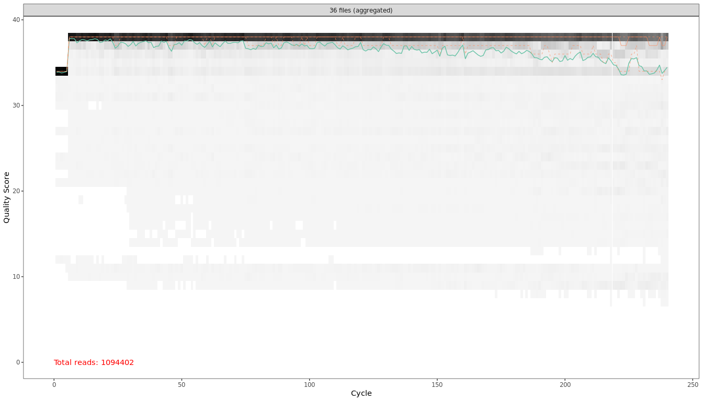
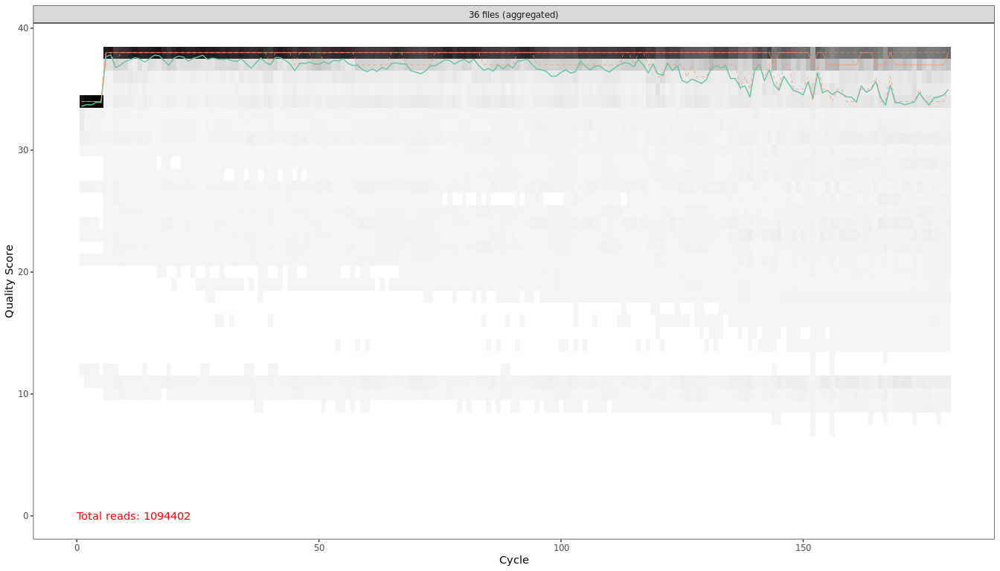
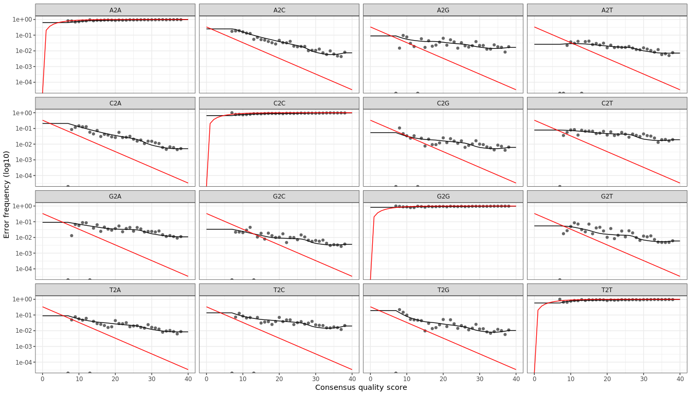

```r
knitr::opts_chunk$set(fig.width=14, fig.height=8) 

library('dada2')
library('phyloseq')
library('dplyr')


set.seed(5678)
setwd('~/Praktikum/TyumGU_2023/')
```

## Read files and data


```r
path <- 'raw'
list.files(path) %>% list()
```

```
## [[1]]
##  [1] "filtered"                                     
##  [2] "zverev-ks-16s-106_S289_L001_R1_001.fastq.gz"  
##  [3] "zverev-ks-16s-106_S289_L001_R2_001.fastq.gz"  
##  [4] "zverev-ks-16s-107_S290_L001_R1_001.fastq.gz"  
##  [5] "zverev-ks-16s-107_S290_L001_R2_001.fastq.gz"  
##  [6] "zverev-ks-16s-108_S291_L001_R1_001.fastq.gz"  
##  [7] "zverev-ks-16s-108_S291_L001_R2_001.fastq.gz"  
##  [8] "zverev-ks-16s-112_S292_L001_R1_001.fastq.gz"  
##  [9] "zverev-ks-16s-112_S292_L001_R2_001.fastq.gz"  
## [10] "zverev-ks-16s-113_S293_L001_R1_001.fastq.gz"  
## [11] "zverev-ks-16s-113_S293_L001_R2_001.fastq.gz"  
## [12] "zverev-ks-16s-114_S294_L001_R1_001.fastq.gz"  
## [13] "zverev-ks-16s-114_S294_L001_R2_001.fastq.gz"  
## [14] "zverev-ks-16s-118_S295_L001_R1_001.fastq.gz"  
## [15] "zverev-ks-16s-118_S295_L001_R2_001.fastq.gz"  
## [16] "zverev-ks-16s-119_S296_L001_R1_001.fastq.gz"  
## [17] "zverev-ks-16s-119_S296_L001_R2_001.fastq.gz"  
## [18] "zverev-ks-16s-120_S297_L001_R1_001.fastq.gz"  
## [19] "zverev-ks-16s-120_S297_L001_R2_001.fastq.gz"  
## [20] "zverev-ks-16s-124_S298_L001_R1_001.fastq.gz"  
## [21] "zverev-ks-16s-124_S298_L001_R2_001.fastq.gz"  
## [22] "zverev-ks-16s-125_S299_L001_R1_001.fastq.gz"  
## [23] "zverev-ks-16s-125_S299_L001_R2_001.fastq.gz"  
## [24] "zverev-ks-16s-126_S300_L001_R1_001.fastq.gz"  
## [25] "zverev-ks-16s-126_S300_L001_R2_001.fastq.gz"  
## [26] "zverev-ks-16s-130_S301_L001_R1_001.fastq.gz"  
## [27] "zverev-ks-16s-130_S301_L001_R2_001.fastq.gz"  
## [28] "zverev-ks-16s-131_S302_L001_R1_001.fastq.gz"  
## [29] "zverev-ks-16s-131_S302_L001_R2_001.fastq.gz"  
## [30] "zverev-ks-16s-132_S303_L001_R1_001.fastq.gz"  
## [31] "zverev-ks-16s-132_S303_L001_R2_001.fastq.gz"  
## [32] "zverev-ks-16s-136_S304_L001_R1_001.fastq.gz"  
## [33] "zverev-ks-16s-136_S304_L001_R2_001.fastq.gz"  
## [34] "zverev-ks-16s-137_S305_L001_R1_001.fastq.gz"  
## [35] "zverev-ks-16s-137_S305_L001_R2_001.fastq.gz"  
## [36] "zverev-ks-16s-138_S306_L001_R1_001.fastq.gz"  
## [37] "zverev-ks-16s-138_S306_L001_R2_001.fastq.gz"  
## [38] "zverev-rhiz-103-16s_S257_L001_R1_001.fastq.gz"
## [39] "zverev-rhiz-103-16s_S257_L001_R2_001.fastq.gz"
## [40] "zverev-rhiz-104-16s_S258_L001_R1_001.fastq.gz"
## [41] "zverev-rhiz-104-16s_S258_L001_R2_001.fastq.gz"
## [42] "zverev-rhiz-105-16s_S259_L001_R1_001.fastq.gz"
## [43] "zverev-rhiz-105-16s_S259_L001_R2_001.fastq.gz"
## [44] "zverev-rhiz-109-16s_S260_L001_R1_001.fastq.gz"
## [45] "zverev-rhiz-109-16s_S260_L001_R2_001.fastq.gz"
## [46] "zverev-rhiz-110-16s_S261_L001_R1_001.fastq.gz"
## [47] "zverev-rhiz-110-16s_S261_L001_R2_001.fastq.gz"
## [48] "zverev-rhiz-111-16s_S262_L001_R1_001.fastq.gz"
## [49] "zverev-rhiz-111-16s_S262_L001_R2_001.fastq.gz"
## [50] "zverev-rhiz-115-16s_S263_L001_R1_001.fastq.gz"
## [51] "zverev-rhiz-115-16s_S263_L001_R2_001.fastq.gz"
## [52] "zverev-rhiz-116-16s_S264_L001_R1_001.fastq.gz"
## [53] "zverev-rhiz-116-16s_S264_L001_R2_001.fastq.gz"
## [54] "zverev-rhiz-117-16s_S265_L001_R1_001.fastq.gz"
## [55] "zverev-rhiz-117-16s_S265_L001_R2_001.fastq.gz"
## [56] "zverev-rhiz-121-16s_S266_L001_R1_001.fastq.gz"
## [57] "zverev-rhiz-121-16s_S266_L001_R2_001.fastq.gz"
## [58] "zverev-rhiz-122-16s_S267_L001_R1_001.fastq.gz"
## [59] "zverev-rhiz-122-16s_S267_L001_R2_001.fastq.gz"
## [60] "zverev-rhiz-123-16s_S268_L001_R1_001.fastq.gz"
## [61] "zverev-rhiz-123-16s_S268_L001_R2_001.fastq.gz"
## [62] "zverev-rhiz-127-16s_S269_L001_R1_001.fastq.gz"
## [63] "zverev-rhiz-127-16s_S269_L001_R2_001.fastq.gz"
## [64] "zverev-rhiz-128-16s_S270_L001_R1_001.fastq.gz"
## [65] "zverev-rhiz-128-16s_S270_L001_R2_001.fastq.gz"
## [66] "zverev-rhiz-129-16s_S271_L001_R1_001.fastq.gz"
## [67] "zverev-rhiz-129-16s_S271_L001_R2_001.fastq.gz"
## [68] "zverev-rhiz-133-16s_S272_L001_R1_001.fastq.gz"
## [69] "zverev-rhiz-133-16s_S272_L001_R2_001.fastq.gz"
## [70] "zverev-rhiz-134-16s_S273_L001_R1_001.fastq.gz"
## [71] "zverev-rhiz-134-16s_S273_L001_R2_001.fastq.gz"
## [72] "zverev-rhiz-135-16s_S274_L001_R1_001.fastq.gz"
## [73] "zverev-rhiz-135-16s_S274_L001_R2_001.fastq.gz"
```


```r
metadata <- read.csv('metadata.csv')
metadata$SampleID <- paste(metadata$Soil, metadata$MainPlant, metadata$Spot, metadata$Illumina_run, sep=".")
metadata
```

```
##               Filename   MainPlant Soil Spot Region Illumina_run
## 1  zverev-rhiz-103-16s       Zlaki  ChZ    1    16s        run_3
## 2  zverev-rhiz-104-16s       Zlaki  ChZ    2    16s        run_3
## 3  zverev-rhiz-105-16s       Zlaki  ChZ    3    16s        run_3
## 4  zverev-rhiz-109-16s      Donnik  ChZ    1    16s        run_3
## 5  zverev-rhiz-110-16s      Donnik  ChZ    2    16s        run_3
## 6  zverev-rhiz-111-16s      Donnik  ChZ    3    16s        run_3
## 7  zverev-rhiz-115-16s       Wheat  ChZ    1    16s        run_3
## 8  zverev-rhiz-116-16s       Wheat  ChZ    2    16s        run_3
## 9  zverev-rhiz-117-16s       Wheat  ChZ    3    16s        run_3
## 10 zverev-rhiz-121-16s       Zlaki   DP    1    16s        run_3
## 11 zverev-rhiz-122-16s       Zlaki   DP    2    16s        run_3
## 12 zverev-rhiz-123-16s       Zlaki   DP    3    16s        run_3
## 13 zverev-rhiz-127-16s Podmarennik   DP    1    16s        run_3
## 14 zverev-rhiz-128-16s Podmarennik   DP    2    16s        run_3
## 15 zverev-rhiz-129-16s Podmarennik   DP    3    16s        run_3
## 16 zverev-rhiz-133-16s         Rye   DP    1    16s        run_3
## 17 zverev-rhiz-134-16s         Rye   DP    2    16s        run_3
## 18 zverev-rhiz-135-16s         Rye   DP    3    16s        run_3
## 19   zverev-ks-16s-106       Zlaki  ChZ    1   Soil        run_4
## 20   zverev-ks-16s-107       Zlaki  ChZ    2    ChZ        run_4
## 21   zverev-ks-16s-108       Zlaki  ChZ    3    ChZ        run_4
## 22   zverev-ks-16s-112      Donnik  ChZ    1    ChZ        run_4
## 23   zverev-ks-16s-113      Donnik  ChZ    2    ChZ        run_4
## 24   zverev-ks-16s-114      Donnik  ChZ    3    ChZ        run_4
## 25   zverev-ks-16s-118       Wheat  ChZ    1    ChZ        run_4
## 26   zverev-ks-16s-119       Wheat  ChZ    2    ChZ        run_4
## 27   zverev-ks-16s-120       Wheat  ChZ    3    ChZ        run_4
## 28   zverev-ks-16s-124       Zlaki   DP    1    ChZ        run_4
## 29   zverev-ks-16s-125       Zlaki   DP    2     DP        run_4
## 30   zverev-ks-16s-126       Zlaki   DP    3     DP        run_4
## 31   zverev-ks-16s-130 Podmarennik   DP    1     DP        run_4
## 32   zverev-ks-16s-131 Podmarennik   DP    2     DP        run_4
## 33   zverev-ks-16s-132 Podmarennik   DP    3     DP        run_4
## 34   zverev-ks-16s-136         Rye   DP    1     DP        run_4
## 35   zverev-ks-16s-137         Rye   DP    2     DP        run_4
## 36   zverev-ks-16s-138         Rye   DP    3     DP        run_4
##                  SampleID
## 1       ChZ.Zlaki.1.run_3
## 2       ChZ.Zlaki.2.run_3
## 3       ChZ.Zlaki.3.run_3
## 4      ChZ.Donnik.1.run_3
## 5      ChZ.Donnik.2.run_3
## 6      ChZ.Donnik.3.run_3
## 7       ChZ.Wheat.1.run_3
## 8       ChZ.Wheat.2.run_3
## 9       ChZ.Wheat.3.run_3
## 10       DP.Zlaki.1.run_3
## 11       DP.Zlaki.2.run_3
## 12       DP.Zlaki.3.run_3
## 13 DP.Podmarennik.1.run_3
## 14 DP.Podmarennik.2.run_3
## 15 DP.Podmarennik.3.run_3
## 16         DP.Rye.1.run_3
## 17         DP.Rye.2.run_3
## 18         DP.Rye.3.run_3
## 19      ChZ.Zlaki.1.run_4
## 20      ChZ.Zlaki.2.run_4
## 21      ChZ.Zlaki.3.run_4
## 22     ChZ.Donnik.1.run_4
## 23     ChZ.Donnik.2.run_4
## 24     ChZ.Donnik.3.run_4
## 25      ChZ.Wheat.1.run_4
## 26      ChZ.Wheat.2.run_4
## 27      ChZ.Wheat.3.run_4
## 28       DP.Zlaki.1.run_4
## 29       DP.Zlaki.2.run_4
## 30       DP.Zlaki.3.run_4
## 31 DP.Podmarennik.1.run_4
## 32 DP.Podmarennik.2.run_4
## 33 DP.Podmarennik.3.run_4
## 34         DP.Rye.1.run_4
## 35         DP.Rye.2.run_4
## 36         DP.Rye.3.run_4
```

## Run DADA2 pipeline

A realisation of a basic tutorial from
https://benjjneb.github.io/dada2/tutorial.html


```r
# Forward and reverse fastq filenames have format: SAMPLENAME_R1_001.fastq and SAMPLENAME_R2_001.fastq
fnFs <- sort(list.files(path, pattern="_R1_001.fastq", full.names = TRUE))
fnRs <- sort(list.files(path, pattern="_R2_001.fastq", full.names = TRUE))
# Extract sample names, assuming filenames have format: SAMPLENAME_XXX.fastq
sample.names <- sapply(strsplit(basename(fnFs), "_"), `[`, 1)
sample.names
```

```
##  [1] "zverev-ks-16s-106"   "zverev-ks-16s-107"   "zverev-ks-16s-108"  
##  [4] "zverev-ks-16s-112"   "zverev-ks-16s-113"   "zverev-ks-16s-114"  
##  [7] "zverev-ks-16s-118"   "zverev-ks-16s-119"   "zverev-ks-16s-120"  
## [10] "zverev-ks-16s-124"   "zverev-ks-16s-125"   "zverev-ks-16s-126"  
## [13] "zverev-ks-16s-130"   "zverev-ks-16s-131"   "zverev-ks-16s-132"  
## [16] "zverev-ks-16s-136"   "zverev-ks-16s-137"   "zverev-ks-16s-138"  
## [19] "zverev-rhiz-103-16s" "zverev-rhiz-104-16s" "zverev-rhiz-105-16s"
## [22] "zverev-rhiz-109-16s" "zverev-rhiz-110-16s" "zverev-rhiz-111-16s"
## [25] "zverev-rhiz-115-16s" "zverev-rhiz-116-16s" "zverev-rhiz-117-16s"
## [28] "zverev-rhiz-121-16s" "zverev-rhiz-122-16s" "zverev-rhiz-123-16s"
## [31] "zverev-rhiz-127-16s" "zverev-rhiz-128-16s" "zverev-rhiz-129-16s"
## [34] "zverev-rhiz-133-16s" "zverev-rhiz-134-16s" "zverev-rhiz-135-16s"
```
### Quality plot


```r
plotQualityProfile(fnFs[1:2])
```

```
## Warning: `guides(<scale> = FALSE)` is deprecated. Please use `guides(<scale> =
## "none")` instead.
```

<!-- -->

```r
# !Long Operations
plotQualityProfile(fnFs, aggregate = T)
```

```
## Warning: `guides(<scale> = FALSE)` is deprecated. Please use `guides(<scale> =
## "none")` instead.
```

<!-- -->

```r
plotQualityProfile(fnRs, aggregate = T)
```

```
## Warning: `guides(<scale> = FALSE)` is deprecated. Please use `guides(<scale> =
## "none")` instead.
```

<!-- -->
### Filter and Trim


```r
filtFs <- file.path(path, "filtered", paste0(sample.names, "_F_filt.fastq.gz"))
filtRs <- file.path(path, "filtered", paste0(sample.names, "_R_filt.fastq.gz"))
names(filtFs) <- sample.names
names(filtRs) <- sample.names

out <- filterAndTrim(fnFs, filtFs, fnRs, filtRs, truncLen=c(240,180),
              maxN=0, maxEE=c(2,2), truncQ=2, rm.phix=TRUE,
              compress=TRUE, multithread=TRUE)
out
```

```
##                                               reads.in reads.out
## zverev-ks-16s-106_S289_L001_R1_001.fastq.gz      43950     35364
## zverev-ks-16s-107_S290_L001_R1_001.fastq.gz      75299     61040
## zverev-ks-16s-108_S291_L001_R1_001.fastq.gz      54162     44017
## zverev-ks-16s-112_S292_L001_R1_001.fastq.gz      59944     48409
## zverev-ks-16s-113_S293_L001_R1_001.fastq.gz      60558     48572
## zverev-ks-16s-114_S294_L001_R1_001.fastq.gz      46119     37291
## zverev-ks-16s-118_S295_L001_R1_001.fastq.gz      31028     17820
## zverev-ks-16s-119_S296_L001_R1_001.fastq.gz      25860     18128
## zverev-ks-16s-120_S297_L001_R1_001.fastq.gz      42011     33113
## zverev-ks-16s-124_S298_L001_R1_001.fastq.gz      43483     34095
## zverev-ks-16s-125_S299_L001_R1_001.fastq.gz      36673     28301
## zverev-ks-16s-126_S300_L001_R1_001.fastq.gz      41932     32173
## zverev-ks-16s-130_S301_L001_R1_001.fastq.gz      45861     34644
## zverev-ks-16s-131_S302_L001_R1_001.fastq.gz      38479     29207
## zverev-ks-16s-132_S303_L001_R1_001.fastq.gz      49939     37271
## zverev-ks-16s-136_S304_L001_R1_001.fastq.gz      42103     32334
## zverev-ks-16s-137_S305_L001_R1_001.fastq.gz      19546     14446
## zverev-ks-16s-138_S306_L001_R1_001.fastq.gz      41492     34401
## zverev-rhiz-103-16s_S257_L001_R1_001.fastq.gz    33979     24110
## zverev-rhiz-104-16s_S258_L001_R1_001.fastq.gz    46702     32848
## zverev-rhiz-105-16s_S259_L001_R1_001.fastq.gz    22163     16043
## zverev-rhiz-109-16s_S260_L001_R1_001.fastq.gz    24249     17213
## zverev-rhiz-110-16s_S261_L001_R1_001.fastq.gz     7040      5081
## zverev-rhiz-111-16s_S262_L001_R1_001.fastq.gz    34051     24741
## zverev-rhiz-115-16s_S263_L001_R1_001.fastq.gz     5665      3905
## zverev-rhiz-116-16s_S264_L001_R1_001.fastq.gz    32573     22991
## zverev-rhiz-117-16s_S265_L001_R1_001.fastq.gz    23851     16938
## zverev-rhiz-121-16s_S266_L001_R1_001.fastq.gz    57379     41764
## zverev-rhiz-122-16s_S267_L001_R1_001.fastq.gz    47610     34512
## zverev-rhiz-123-16s_S268_L001_R1_001.fastq.gz    44877     33311
## zverev-rhiz-127-16s_S269_L001_R1_001.fastq.gz    38419     27924
## zverev-rhiz-128-16s_S270_L001_R1_001.fastq.gz    46149     34519
## zverev-rhiz-129-16s_S271_L001_R1_001.fastq.gz    37313     27654
## zverev-rhiz-133-16s_S272_L001_R1_001.fastq.gz    47535     35258
## zverev-rhiz-134-16s_S273_L001_R1_001.fastq.gz    43138     31703
## zverev-rhiz-135-16s_S274_L001_R1_001.fastq.gz    59948     43261
```

### Trimmed quality plot


```r
# !Long Operations
plotQualityProfile(filtFs, aggregate = T)
```

```
## Warning: `guides(<scale> = FALSE)` is deprecated. Please use `guides(<scale> =
## "none")` instead.
```

<!-- -->

```r
plotQualityProfile(filtRs, aggregate = T)
```

```
## Warning: `guides(<scale> = FALSE)` is deprecated. Please use `guides(<scale> =
## "none")` instead.
```

<!-- -->

Reads are trimmed fairly, everything is OK, go to the next step

### Build a model and apply it


```r
# !Long Operation
errF <- learnErrors(filtFs, multithread=TRUE)
```

```
## 105197520 total bases in 438323 reads from 12 samples will be used for learning the error rates.
```

```r
errR <- learnErrors(filtRs, multithread=TRUE)
```

```
## 102920220 total bases in 571779 reads from 16 samples will be used for learning the error rates.
```

```r
plotErrors(errF, nominalQ=TRUE)
```

```
## Warning: Transformation introduced infinite values in continuous y-axis
## Transformation introduced infinite values in continuous y-axis
```

<!-- -->

```r
dadaFs <- dada(filtFs, err=errF, multithread=TRUE)
```

```
## Sample 1 - 35364 reads in 24063 unique sequences.
## Sample 2 - 61040 reads in 38868 unique sequences.
## Sample 3 - 44017 reads in 30505 unique sequences.
## Sample 4 - 48409 reads in 33900 unique sequences.
## Sample 5 - 48572 reads in 36486 unique sequences.
## Sample 6 - 37291 reads in 25925 unique sequences.
## Sample 7 - 17820 reads in 9266 unique sequences.
## Sample 8 - 18128 reads in 10577 unique sequences.
## Sample 9 - 33113 reads in 21902 unique sequences.
## Sample 10 - 34095 reads in 22527 unique sequences.
## Sample 11 - 28301 reads in 18927 unique sequences.
## Sample 12 - 32173 reads in 22028 unique sequences.
## Sample 13 - 34644 reads in 22997 unique sequences.
## Sample 14 - 29207 reads in 21463 unique sequences.
## Sample 15 - 37271 reads in 27755 unique sequences.
## Sample 16 - 32334 reads in 21263 unique sequences.
## Sample 17 - 14446 reads in 11261 unique sequences.
## Sample 18 - 34401 reads in 28117 unique sequences.
## Sample 19 - 24110 reads in 18546 unique sequences.
## Sample 20 - 32848 reads in 25888 unique sequences.
## Sample 21 - 16043 reads in 12889 unique sequences.
## Sample 22 - 17213 reads in 14050 unique sequences.
## Sample 23 - 5081 reads in 4247 unique sequences.
## Sample 24 - 24741 reads in 19849 unique sequences.
## Sample 25 - 3905 reads in 3380 unique sequences.
## Sample 26 - 22991 reads in 18037 unique sequences.
## Sample 27 - 16938 reads in 11686 unique sequences.
## Sample 28 - 41764 reads in 32813 unique sequences.
## Sample 29 - 34512 reads in 26921 unique sequences.
## Sample 30 - 33311 reads in 25551 unique sequences.
## Sample 31 - 27924 reads in 21710 unique sequences.
## Sample 32 - 34519 reads in 24392 unique sequences.
## Sample 33 - 27654 reads in 20994 unique sequences.
## Sample 34 - 35258 reads in 26595 unique sequences.
## Sample 35 - 31703 reads in 24336 unique sequences.
## Sample 36 - 43261 reads in 33572 unique sequences.
```

```r
dadaRs <- dada(filtRs, err=errR, multithread=TRUE)
```

```
## Sample 1 - 35364 reads in 25162 unique sequences.
## Sample 2 - 61040 reads in 41574 unique sequences.
## Sample 3 - 44017 reads in 31575 unique sequences.
## Sample 4 - 48409 reads in 34164 unique sequences.
## Sample 5 - 48572 reads in 37076 unique sequences.
## Sample 6 - 37291 reads in 26959 unique sequences.
## Sample 7 - 17820 reads in 13224 unique sequences.
## Sample 8 - 18128 reads in 12567 unique sequences.
## Sample 9 - 33113 reads in 23522 unique sequences.
## Sample 10 - 34095 reads in 24819 unique sequences.
## Sample 11 - 28301 reads in 21039 unique sequences.
## Sample 12 - 32173 reads in 23832 unique sequences.
## Sample 13 - 34644 reads in 25895 unique sequences.
## Sample 14 - 29207 reads in 22629 unique sequences.
## Sample 15 - 37271 reads in 28324 unique sequences.
## Sample 16 - 32334 reads in 23880 unique sequences.
## Sample 17 - 14446 reads in 11285 unique sequences.
## Sample 18 - 34401 reads in 28414 unique sequences.
## Sample 19 - 24110 reads in 16239 unique sequences.
## Sample 20 - 32848 reads in 23007 unique sequences.
## Sample 21 - 16043 reads in 11889 unique sequences.
## Sample 22 - 17213 reads in 13143 unique sequences.
## Sample 23 - 5081 reads in 4038 unique sequences.
## Sample 24 - 24741 reads in 18172 unique sequences.
## Sample 25 - 3905 reads in 3190 unique sequences.
## Sample 26 - 22991 reads in 16369 unique sequences.
## Sample 27 - 16938 reads in 11288 unique sequences.
## Sample 28 - 41764 reads in 30918 unique sequences.
## Sample 29 - 34512 reads in 25017 unique sequences.
## Sample 30 - 33311 reads in 24552 unique sequences.
## Sample 31 - 27924 reads in 21295 unique sequences.
## Sample 32 - 34519 reads in 23538 unique sequences.
## Sample 33 - 27654 reads in 20024 unique sequences.
## Sample 34 - 35258 reads in 25081 unique sequences.
## Sample 35 - 31703 reads in 22599 unique sequences.
## Sample 36 - 43261 reads in 31816 unique sequences.
```

### Merge reads and create table


```r
# !Long Operation
mergers <- mergePairs(dadaFs, filtFs, dadaRs, filtRs, verbose=TRUE)
```

```
## 18519 paired-reads (in 517 unique pairings) successfully merged out of 29238 (in 3523 pairings) input.
```

```
## 30891 paired-reads (in 989 unique pairings) successfully merged out of 50865 (in 6966 pairings) input.
```

```
## 20714 paired-reads (in 636 unique pairings) successfully merged out of 35692 (in 4991 pairings) input.
```

```
## 23577 paired-reads (in 718 unique pairings) successfully merged out of 39913 (in 5393 pairings) input.
```

```
## 20821 paired-reads (in 549 unique pairings) successfully merged out of 39352 (in 5782 pairings) input.
```

```
## 18383 paired-reads (in 553 unique pairings) successfully merged out of 30780 (in 4010 pairings) input.
```

```
## 8391 paired-reads (in 292 unique pairings) successfully merged out of 15409 (in 1465 pairings) input.
```

```
## 8774 paired-reads (in 318 unique pairings) successfully merged out of 15286 (in 1517 pairings) input.
```

```
## 16868 paired-reads (in 515 unique pairings) successfully merged out of 27482 (in 3307 pairings) input.
```

```
## 15087 paired-reads (in 475 unique pairings) successfully merged out of 27343 (in 3513 pairings) input.
```

```
## 11789 paired-reads (in 376 unique pairings) successfully merged out of 22180 (in 2661 pairings) input.
```

```
## 14133 paired-reads (in 400 unique pairings) successfully merged out of 25478 (in 2928 pairings) input.
```

```
## 14919 paired-reads (in 439 unique pairings) successfully merged out of 28069 (in 3357 pairings) input.
```

```
## 11209 paired-reads (in 307 unique pairings) successfully merged out of 22665 (in 2819 pairings) input.
```

```
## 14827 paired-reads (in 449 unique pairings) successfully merged out of 28255 (in 3686 pairings) input.
```

```
## 13816 paired-reads (in 455 unique pairings) successfully merged out of 25825 (in 3102 pairings) input.
```

```
## 5170 paired-reads (in 153 unique pairings) successfully merged out of 10624 (in 1072 pairings) input.
```

```
## 11176 paired-reads (in 248 unique pairings) successfully merged out of 24262 (in 3841 pairings) input.
```

```
## 12106 paired-reads (in 311 unique pairings) successfully merged out of 19214 (in 2177 pairings) input.
```

```
## 14789 paired-reads (in 410 unique pairings) successfully merged out of 26078 (in 3442 pairings) input.
```

```
## 6469 paired-reads (in 197 unique pairings) successfully merged out of 11846 (in 1382 pairings) input.
```

```
## 7104 paired-reads (in 191 unique pairings) successfully merged out of 12952 (in 1407 pairings) input.
```

```
## 1726 paired-reads (in 78 unique pairings) successfully merged out of 3311 (in 368 pairings) input.
```

```
## 10686 paired-reads (in 267 unique pairings) successfully merged out of 18933 (in 2438 pairings) input.
```

```
## 1153 paired-reads (in 46 unique pairings) successfully merged out of 2434 (in 236 pairings) input.
```

```
## 11519 paired-reads (in 310 unique pairings) successfully merged out of 18229 (in 2140 pairings) input.
```

```
## 8742 paired-reads (in 307 unique pairings) successfully merged out of 14343 (in 1458 pairings) input.
```

```
## 18837 paired-reads (in 442 unique pairings) successfully merged out of 33078 (in 4108 pairings) input.
```

```
## 14471 paired-reads (in 347 unique pairings) successfully merged out of 26967 (in 3215 pairings) input.
```

```
## 14268 paired-reads (in 337 unique pairings) successfully merged out of 25684 (in 3154 pairings) input.
```

```
## 11694 paired-reads (in 278 unique pairings) successfully merged out of 22287 (in 2649 pairings) input.
```

```
## 17167 paired-reads (in 422 unique pairings) successfully merged out of 28613 (in 3209 pairings) input.
```

```
## 12390 paired-reads (in 352 unique pairings) successfully merged out of 21970 (in 2658 pairings) input.
```

```
## 15626 paired-reads (in 395 unique pairings) successfully merged out of 28369 (in 3516 pairings) input.
```

```
## 15138 paired-reads (in 392 unique pairings) successfully merged out of 25354 (in 3048 pairings) input.
```

```
## 19060 paired-reads (in 478 unique pairings) successfully merged out of 34753 (in 4470 pairings) input.
```

```r
seqtab <- makeSequenceTable(mergers)
dim(seqtab)
```

```
## [1]   36 8038
```

### Taxonomy annotation


```r
seqtab.nochim <- removeBimeraDenovo(seqtab, method="consensus", multithread=TRUE, verbose=TRUE)
```

```
## Identified 1183 bimeras out of 8038 input sequences.
```

```r
dim(seqtab.nochim)
```

```
## [1]   36 6855
```

```r
sum(seqtab.nochim)/sum(seqtab)
```

```
## [1] 0.9039509
```


```r
getN <- function(x) sum(getUniques(x))
track <- cbind(out, sapply(dadaFs, getN), sapply(dadaRs, getN), sapply(mergers, getN), rowSums(seqtab.nochim))
# If processing a single sample, remove the sapply calls: e.g. replace sapply(dadaFs, getN) with getN(dadaFs)
colnames(track) <- c("input", "filtered", "denoisedF", "denoisedR", "merged", "nonchim")
rownames(track) <- sample.names
track
```

```
##                     input filtered denoisedF denoisedR merged nonchim
## zverev-ks-16s-106   43950    35364     30854     32517  18519   16477
## zverev-ks-16s-107   75299    61040     53717     56411  30891   26735
## zverev-ks-16s-108   54162    44017     38032     40009  20714   18557
## zverev-ks-16s-112   59944    48409     42172     44582  23577   20564
## zverev-ks-16s-113   60558    48572     41462     44705  20821   18695
## zverev-ks-16s-114   46119    37291     32477     34349  18383   16348
## zverev-ks-16s-118   31028    17820     16389     16555   8391    7491
## zverev-ks-16s-119   25860    18128     16271     16652   8774    7732
## zverev-ks-16s-120   42011    33113     29062     30382  16868   14966
## zverev-ks-16s-124   43483    34095     29228     30789  15087   13801
## zverev-ks-16s-125   36673    28301     23988     25215  11789   11297
## zverev-ks-16s-126   41932    32173     27165     28912  14133   13042
## zverev-ks-16s-130   45861    34644     29936     31466  14919   14116
## zverev-ks-16s-131   38479    29207     24367     26108  11209   11003
## zverev-ks-16s-132   49939    37271     30501     32979  14827   13965
## zverev-ks-16s-136   42103    32334     27736     29057  13816   13115
## zverev-ks-16s-137   19546    14446     11664     12360   5170    4833
## zverev-ks-16s-138   41492    34401     26135     30377  11176   10522
## zverev-rhiz-103-16s 33979    24110     20448     21853  12106   10205
## zverev-rhiz-104-16s 46702    32848     27894     29694  14789   13414
## zverev-rhiz-105-16s 22163    16043     12806     14128   6469    5878
## zverev-rhiz-109-16s 24249    17213     13832     15309   7104    6791
## zverev-rhiz-110-16s  7040     5081      3750      4177   1726    1634
## zverev-rhiz-111-16s 34051    24741     20425     22019  10686    9842
## zverev-rhiz-115-16s  5665     3905      2781      3156   1153    1140
## zverev-rhiz-116-16s 32573    22991     19493     20810  11519   10309
## zverev-rhiz-117-16s 23851    16938     15327     15541   8742    7910
## zverev-rhiz-121-16s 57379    41764     35375     37817  18837   17540
## zverev-rhiz-122-16s 47610    34512     29031     30950  14471   13428
## zverev-rhiz-123-16s 44877    33311     27713     29710  14268   13145
## zverev-rhiz-127-16s 38419    27924     23858     25234  11694   10975
## zverev-rhiz-128-16s 46149    34519     30307     31674  17167   14541
## zverev-rhiz-129-16s 37313    27654     23787     24722  12390   11109
## zverev-rhiz-133-16s 47535    35258     30469     31921  15626   13946
## zverev-rhiz-134-16s 43138    31703     27109     28669  15138   13045
## zverev-rhiz-135-16s 59948    43261     37202     39248  19060   16641
```

Merging leads to losses in reads. Re-run more relaxed filtering


```r
taxa <- assignTaxonomy(seqtab.nochim, "~/tax_n_refs/silva_nr_v138_train_set.fa.gz", multithread=TRUE)

taxa.print <- taxa # Removing sequence rownames for display only
rownames(taxa.print) <- NULL
head(taxa.print)
```

```
##      Kingdom    Phylum           Class                 Order            
## [1,] "Bacteria" "Firmicutes"     "Bacilli"             "Bacillales"     
## [2,] "Bacteria" "Firmicutes"     "Bacilli"             "Bacillales"     
## [3,] "Bacteria" "Firmicutes"     "Bacilli"             "Bacillales"     
## [4,] "Bacteria" "Firmicutes"     "Bacilli"             "Bacillales"     
## [5,] "Bacteria" "Firmicutes"     "Bacilli"             "Bacillales"     
## [6,] "Bacteria" "Proteobacteria" "Gammaproteobacteria" "Burkholderiales"
##      Family           Genus
## [1,] NA               NA   
## [2,] NA               NA   
## [3,] NA               NA   
## [4,] "Planococcaceae" NA   
## [5,] NA               NA   
## [6,] "Comamonadaceae" NA
```
 

```r
rownames(metadata) <- metadata$Filename

ps <- phyloseq(otu_table(seqtab.nochim, taxa_are_rows=FALSE), 
               sample_data(metadata), 
               tax_table(taxa))
ps
```

```
## phyloseq-class experiment-level object
## otu_table()   OTU Table:         [ 6855 taxa and 36 samples ]
## sample_data() Sample Data:       [ 36 samples by 7 sample variables ]
## tax_table()   Taxonomy Table:    [ 6855 taxa by 6 taxonomic ranks ]
```

```r
sample_names(ps)
```

```
##  [1] "zverev-ks-16s-106"   "zverev-ks-16s-107"   "zverev-ks-16s-108"  
##  [4] "zverev-ks-16s-112"   "zverev-ks-16s-113"   "zverev-ks-16s-114"  
##  [7] "zverev-ks-16s-118"   "zverev-ks-16s-119"   "zverev-ks-16s-120"  
## [10] "zverev-ks-16s-124"   "zverev-ks-16s-125"   "zverev-ks-16s-126"  
## [13] "zverev-ks-16s-130"   "zverev-ks-16s-131"   "zverev-ks-16s-132"  
## [16] "zverev-ks-16s-136"   "zverev-ks-16s-137"   "zverev-ks-16s-138"  
## [19] "zverev-rhiz-103-16s" "zverev-rhiz-104-16s" "zverev-rhiz-105-16s"
## [22] "zverev-rhiz-109-16s" "zverev-rhiz-110-16s" "zverev-rhiz-111-16s"
## [25] "zverev-rhiz-115-16s" "zverev-rhiz-116-16s" "zverev-rhiz-117-16s"
## [28] "zverev-rhiz-121-16s" "zverev-rhiz-122-16s" "zverev-rhiz-123-16s"
## [31] "zverev-rhiz-127-16s" "zverev-rhiz-128-16s" "zverev-rhiz-129-16s"
## [34] "zverev-rhiz-133-16s" "zverev-rhiz-134-16s" "zverev-rhiz-135-16s"
```
 
### Rename phyloseq-object according to our needs
 

```r
## Rename Samples
new.names <- ps@sam_data %>% 
  data.frame() %>% 
  dplyr::select(Filename, SampleID) %>%  
  arrange(Filename, levels = sample_names(ps))

if (all(sample_names(ps) == new.names$Filename)) {
  sample_names(ps) <- ps@sam_data$SampleID
  print("Renamed")
}
```

```
## [1] "Renamed"
```

```r
sample_names(ps)
```

```
##  [1] "ChZ.Zlaki.1.run_4"      "ChZ.Zlaki.2.run_4"      "ChZ.Zlaki.3.run_4"     
##  [4] "ChZ.Donnik.1.run_4"     "ChZ.Donnik.2.run_4"     "ChZ.Donnik.3.run_4"    
##  [7] "ChZ.Wheat.1.run_4"      "ChZ.Wheat.2.run_4"      "ChZ.Wheat.3.run_4"     
## [10] "DP.Zlaki.1.run_4"       "DP.Zlaki.2.run_4"       "DP.Zlaki.3.run_4"      
## [13] "DP.Podmarennik.1.run_4" "DP.Podmarennik.2.run_4" "DP.Podmarennik.3.run_4"
## [16] "DP.Rye.1.run_4"         "DP.Rye.2.run_4"         "DP.Rye.3.run_4"        
## [19] "ChZ.Zlaki.1.run_3"      "ChZ.Zlaki.2.run_3"      "ChZ.Zlaki.3.run_3"     
## [22] "ChZ.Donnik.1.run_3"     "ChZ.Donnik.2.run_3"     "ChZ.Donnik.3.run_3"    
## [25] "ChZ.Wheat.1.run_3"      "ChZ.Wheat.2.run_3"      "ChZ.Wheat.3.run_3"     
## [28] "DP.Zlaki.1.run_3"       "DP.Zlaki.2.run_3"       "DP.Zlaki.3.run_3"      
## [31] "DP.Podmarennik.1.run_3" "DP.Podmarennik.2.run_3" "DP.Podmarennik.3.run_3"
## [34] "DP.Rye.1.run_3"         "DP.Rye.2.run_3"         "DP.Rye.3.run_3"
```


```r
dna <- Biostrings::DNAStringSet(taxa_names(ps))
names(dna) <- taxa_names(ps)
ps <- merge_phyloseq(ps, dna)
taxa_names(ps) <- paste0("ASV", seq(ntaxa(ps)))
```

## Save phyloseq-object and aquire checksum


```r
saveRDS(ps, "ps.RData")
ps <- readRDS("ps.RData")

tools::md5sum("ps.RData")
```

```
##                           ps.RData 
## "bc3b597f5ba6944d1b77f44ace87c81f"
```

